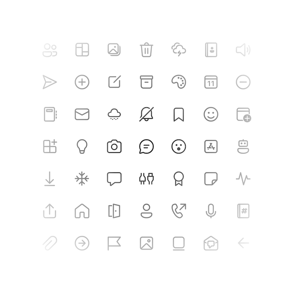

# Fluent System Icons
Fluent System Icons is a set of mobile platform icons from Microsoft.



## Installation
### Android
Add the `microsoftdesign` repository to your project's top level `build.gradle`:
```groovy
repositories {
    maven {
        name 'vsts-maven-microsoftdesign'
        url 'https://pkgs.dev.azure.com/microsoftdesign/951975d5-69cc-4771-9d98-92a4b1a82b2b/_packaging/fluent-icons/maven/v1'
        credentials {
            username = [Your VSTS username]
            password = [Your VSTS access token]
        }
    }
    ...
}
```
Include the following dependency in your project's `build.gradle`
```groovy
implementation 'com.microsoft.design:fluent-icons:1.0.223'
```

For library docs, see [android/README.md](android/README.md).

### iOS
#### Cocoapods

```ruby
pod "FluentIcons", git: "https://microsoftdesign@dev.azure.com/microsoftdesign/Design%20System/_git/fluent-mobile-icons", tag: "1.0.223"
```

#### Carthage

```bash
git "git@ssh.dev.azure.com:v3/microsoftdesign/Design%20System/fluent-mobile-icons" "1.0.223"
```

For library docs, see [ios/README.md](ios/README.md).

## Contributing

### Importer

The importer generates the Android and iOS libraries from the icons in the `assets` directory.

Jump into the directory
```
cd importer
```

Install npm dependencies
```
npm install
npm run clean
```

List all the available commands
```
npm run
```

### Build Pipeline

Our [build pipeline](https://dev.azure.com/microsoftdesign/Design%20System/_build?definitionId=94&_a=summary) runs `deploy:android` and `deploy:ios` to create the libraries. The build definitions are in `azure-pipelines.yml` and `pipelines`.

## Demo apps

You can download the demo apps from AppCenter or build them following the steps below.

### Android ([Download](https://install.appcenter.ms/orgs/Fluent-Design-Mobile/apps/Fluent-Mobile-Icons-Demo))
1. Open the [android](android) directory in Android Studio
2. Select the `sample-showcase` in the build configuration dropdown
3. Click run 

### Mac ([Download](https://install.appcenter.ms/orgs/Fluent-Design-Mobile/apps/Fluent-Mac-App))
1. `open ios/FluentIcons.xcworkspace/`
2. Product > Run

## Contact
Please feel free to reach out to the following points of contact with questions or requests.
* [Joe Woodward](mailto:joe.woodward@microsoft.com) / [Jason Custer](mailto:jacust@microsoft.com) - Design
* [Nick Romano](mailto:nick.romano@microsoft.com) - iOS
* [Will Hou](mailto:wih@microsoft.com) - Android

## Code of Conduct
This project has adopted the [Microsoft Open Source Code of Conduct](https://opensource.microsoft.com/codeofconduct). For more information see the [Code of Conduct FAQ](https://opensource.microsoft.com/codeofconduct) or contact opencode@microsoft.com with any additional questions or comments.